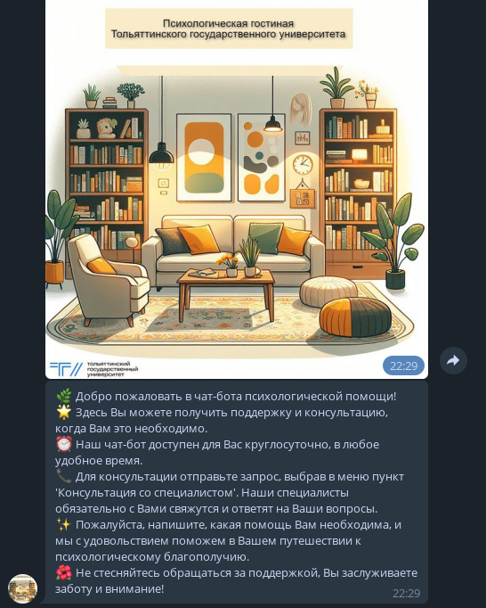
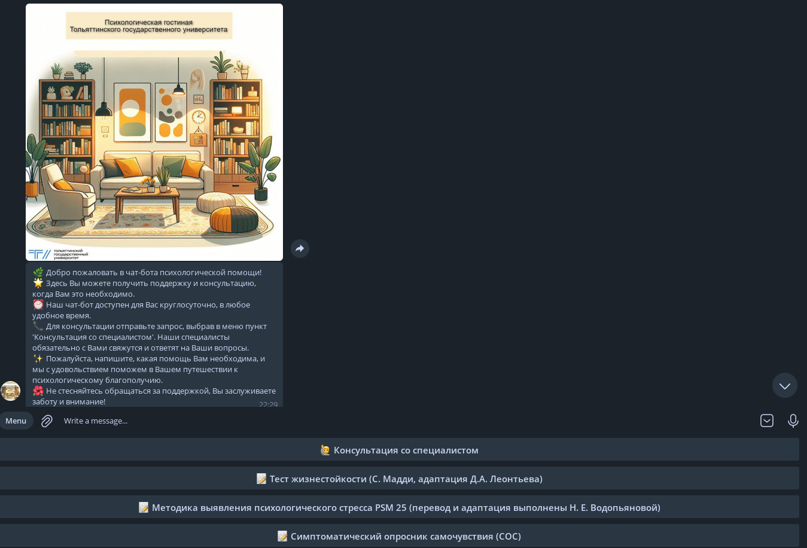
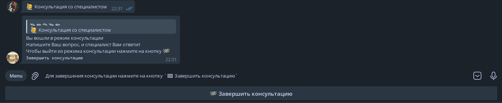
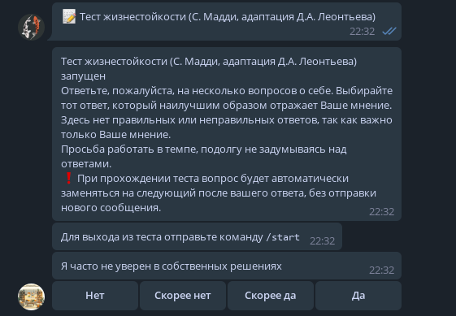

# Технологии:
- [x] Python 3.12.2
- [x] poetry
- [x] aiogram
- [x] logging

# Запуск бота:
```python
poetry run python main.py {API_ID} {API_HASH} {BOT_TOKEN}
```

# TODO
- [ ] Доделать тест на шкалу оптимизма
- [x] Доработка пользовательского интерфейса без / (слэш) комманд

# Notes
Нужно разрешить forward message для ответа на сообщения

# Скриншоты работы







